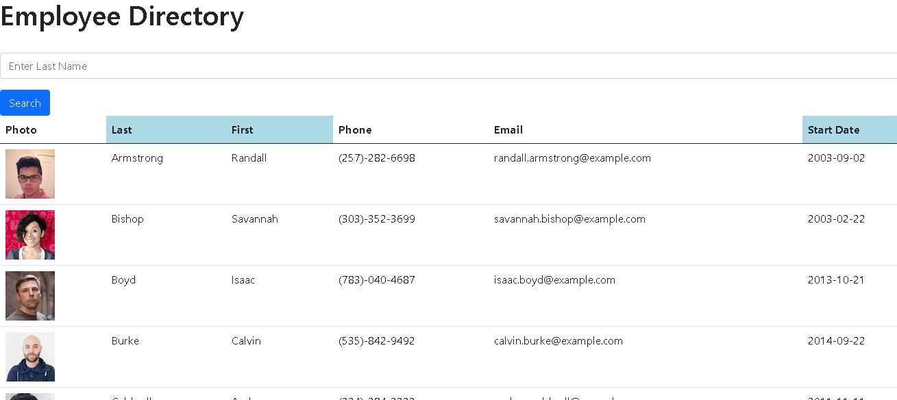

# employee-directory

A basic Employee Directory developed by Skyler Blakeslee.

URL: https://dry-sierra-40120.herokuapp.com/
Git Repository: https://github.com/skyler-blakeslee/employee-directory

## Table of Contents
- [Description](#description)
- [Major Technologies](#major_technologies)
- [Screenshots](#screenshots)

## Description

This React application demonstrates sort and filter functions in the context of a generic employee directory. Upon mounting, a request is made to the [Random User Generator API](https://randomuser.me/) for 60 random employee profiles. These are displayed in table form with various information. The list may be sorted by Last Name, First Name, and Start Date by clicking the respective table headings. Users may search for employees by last name using the search form. Clicking the search button with an empty input field reverts the results area to the original, full list of employees.

## Major_Technologies

- Node.js
- React

## Screenshots

